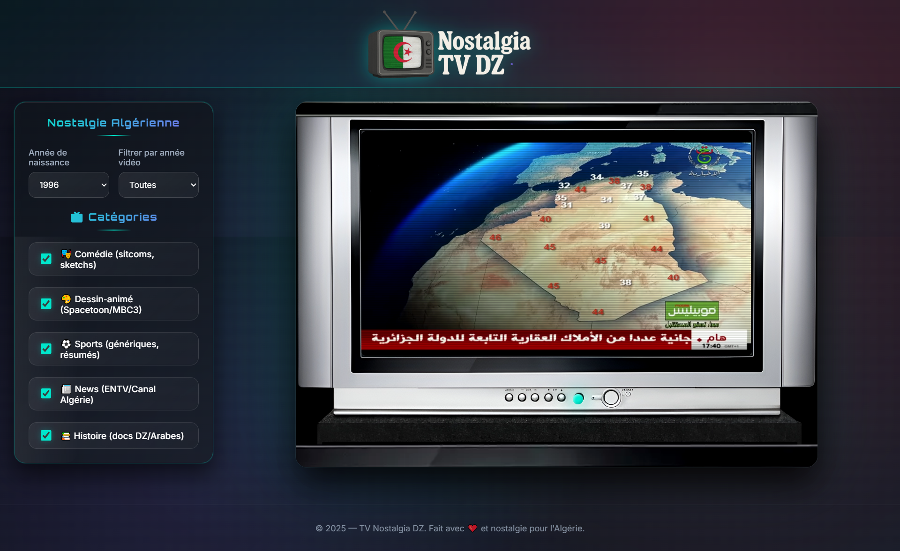

# 📺 TV Nostalgia DZ

> **Revivez la magie de la télévision algérienne des années 90-2000s**

TV Nostalgia DZ est une expérience nostalgique interactive qui recrée l'ambiance authentique de regarder la télévision algérienne dans les années 1990-2000. Avec une interface de TV rétro réaliste, des effets sonores immersifs et une collection de contenus cultes, plongez dans vos souvenirs d'enfance !



## 🌟 Fonctionnalités

### 📺 **Interface TV Authentique**
- **Design rétro réaliste** avec effets CRT authentiques
- **Sons de TV** (allumage, extinction, parasites)
- **Effets visuels** : scanlines, phosphore, glitch VHS
- **Contrôles physiques** : power, volume, canaux

### 🎯 **Expérience Personnalisée**
- **Profils générationnels** selon votre année de naissance
- **Filtrage intelligent** par catégories et années
- **Contenu adapté** à votre époque (early 90s, mid 90s, late 90s)

### 🎬 **5 Catégories Nostalgiques**
- **🎭 Comédie** : Nass Mlah City, Djamaa Family, sketches
- **🎨 Dessins Animés** : Spacetoon, MBC3, anime en arabe
- **⚽ Sports** : Équipe nationale, football algérien
- **📰 News** : JT ENTV, Canal Algérie vintage
- **📚 Histoire** : Documentaires, patrimoine DZ

### 🔊 **Système Audio Immersif**
- **Sons authentiques** de TV vintage
- **Effets synchronisés** avec les transitions
- **Ambiance sonore** réaliste

## 🚀 Installation

### Prérequis
- Serveur web local (Apache, Nginx, ou Python HTTP server)
- Navigateur moderne supportant HTML5

### Installation Simple
```bash
# Cloner le repository
git clone https://github.com/filinodz/nostalgiatvdz.git

# Aller dans le dossier
cd nostalgiatvdz

# Lancer un serveur local (Python)
python -m http.server 8000

# Ou avec Node.js
npx serve .

# Ouvrir dans le navigateur
http://localhost:8000
```

## 📁 Structure du Projet

```
nostalgiatvdz/
├── index.html              # Page principale
├── img/
│   ├── logo.png            # Logo du site
│   ├── tvbackclean.png     # Image de fond TV
│   ├── tvback.png          # Overlay TV
│   ├── vhs-glitch.gif      # Effet glitch VHS
│   └── tvstatic.gif        # Static TV
├── sounds/
│   ├── tv-noise.mp3        # Son de parasites
│   ├── tvon.mp3           # Son d'allumage
│   └── tvoff.mp3          # Son d'extinction
└── README.md              # Ce fichier
```

## 🛠️ Personnalisation

### Modifier les Vidéos

Pour ajouter ou modifier les vidéos, éditez la base de données dans `index.html` :

```javascript
const VIDEO_DATABASE = {
  Comedie: [
    {
      id: "ID_YOUTUBE", 
      title: "Titre de la vidéo", 
      channel: "Nom de la chaîne", 
      year: 2005, 
      thumb: ""
    },
    // ... autres vidéos
  ],
  // ... autres catégories
};
```

### Ajouter une Nouvelle Catégorie

1. **Ajouter dans CATEGORIES** :
```javascript
const CATEGORIES = ["Comedie", "DessinAnime", "Sports", "News", "Histoire", "NouvelleCat"];
```

2. **Ajouter dans VIDEO_DATABASE** :
```javascript
const VIDEO_DATABASE = {
  // ... catégories existantes
  NouvelleCat: [
    {id: "ID_YOUTUBE", title: "Titre", channel: "Chaîne", year: 2000, thumb: ""}
  ]
};
```

3. **Ajouter dans le HTML** :
```html
<div class="category">
  <input type="checkbox" id="cat_NouvelleCat" data-cat="NouvelleCat" checked>
  <label for="cat_NouvelleCat">🎪 Nouvelle Catégorie</label>
</div>
```

### Personnaliser les Profils Générationnels

Modifiez les préférences par génération :

```javascript
const GENERATION_PREFERENCES = {
  early90s: {
    NouvelleCat: [0, 2, 4], // Indices des vidéos préférées
  },
  mid90s: {
    NouvelleCat: [1, 3, 5],
  },
  late90s: {
    NouvelleCat: [2, 4, 6],
  }
};
```

### Remplacer les Assets

- **Logo** : Remplacez `./img/logo.png` (format PNG transparent recommandé)
- **TV Background** : Remplacez `./img/tvbackclean.png` et `./img/tvback.png`
- **Sons** : Remplacez les fichiers dans `./sounds/` (format MP3)

## 🎮 Utilisation

### Contrôles Clavier
- **P** ou **Espace** : Power On/Off
- **→** : Canal suivant
- **←** : Canal précédent  
- **↑** : Volume +
- **↓** : Volume -

### Contrôles Souris
- Cliquez sur les boutons physiques de la TV
- Utilisez la sidebar pour filtrer le contenu

### Filtrage du Contenu
1. **Année de naissance** : Adapte le contenu à votre génération
2. **Filtre année** : Affiche uniquement les vidéos d'une année spécifique
3. **Catégories** : Cochez/décochez pour personnaliser

## 🔧 Configuration Avancée

### Modifier les Paramètres de Lecture

```javascript
// Dans index.html, section CONFIG
const OFFSET_MIN = 10;        // Début minimum de vidéo (secondes)
const OFFSET_MAX = 120;       // Début maximum de vidéo (secondes)
const CACHE_TTL_MIN = 720;    // Durée du cache (minutes)
```

### Ajuster les Volumes Audio

```javascript
// Dans la fonction initAudio()
tvNoiseAudio.volume = 0.4;    // Volume des parasites (0.0 - 1.0)
tvOnAudio.volume = 0.6;       // Volume allumage
tvOffAudio.volume = 0.5;      // Volume extinction
```

## 🐛 Résolution de Problèmes

### Les vidéos ne se chargent pas
- Vérifiez que les IDs YouTube sont valides
- Assurez-vous que le serveur local fonctionne
- Vérifiez la console navigateur pour les erreurs

### Pas de son
- Activez l'autoplay dans votre navigateur
- Cliquez sur la page pour permettre l'audio
- Vérifiez que les fichiers audio existent

### Interface non responsive
- Vérifiez que vous utilisez un serveur local
- Testez avec un autre navigateur
- Vérifiez la console pour les erreurs CSS

## 🤝 Contribution

Les contributions sont les bienvenues ! 

1. Fork le projet
2. Créez une branche feature (`git checkout -b feature/AmazingFeature`)
3. Commit vos changements (`git commit -m 'Add some AmazingFeature'`)
4. Push sur la branche (`git push origin feature/AmazingFeature`)
5. Ouvrez une Pull Request

### Idées de Contributions
- Ajouter plus de vidéos nostalgiques
- Améliorer les effets visuels
- Ajouter de nouveaux sons authentiques
- Créer des thèmes alternatifs
- Optimiser les performances

## 📝 Licence

Ce projet est sous licence MIT. Voir le fichier `LICENSE` pour plus de détails.

## 🙏 Crédits

### Inspirations
- **Télévision algérienne** des années 90-2000
- **Spacetoon & MBC3** pour les souvenirs d'enfance
- **ENTV & Canal Algérie** pour le patrimoine audiovisuel

### Technologies
- **HTML5 & CSS3** pour l'interface
- **JavaScript ES6+** pour la logique
- **YouTube Player API** pour la lecture vidéo
- **Web Audio API** pour les effets sonores

### Remerciements
- Communauté nostalgique algérienne
- Créateurs de contenu vintage
- Développeurs open source

---

## 📞 Contact

**Projet** : TV Nostalgia DZ  
**GitHub** : [https://github.com/filinodz/nostalgiatvdz](https://github.com/filinodz/nostalgiatvdz)

---

⭐ **Si ce projet vous rappelle de bons souvenirs, n'hésitez pas à lui donner une étoile !** ⭐

🇩🇿 **Fait avec ❤️ et nostalgie pour l'Algérie**
